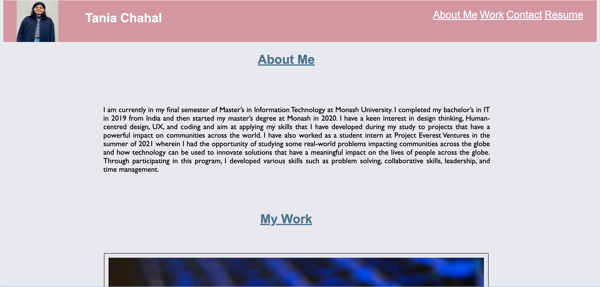
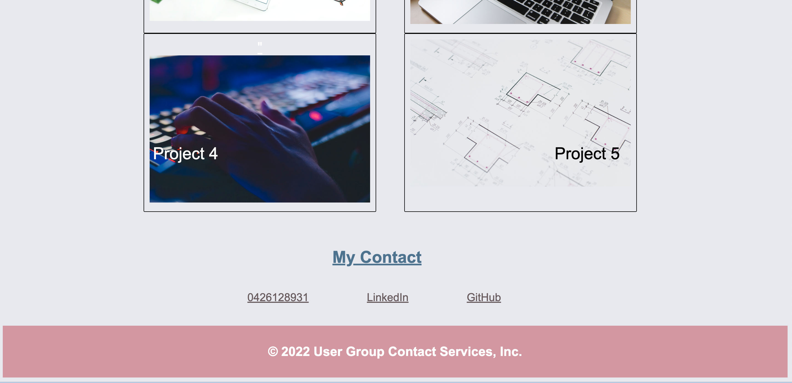

# module-2-challenge
#  User Work Portfolio

## Description

The following project creates a work portfolio webpage for a candidate to showcase his/her skills and talents to future employers for part-time or full-time roles.
The webpage contains information about the candidate, their deployed applications, and contact information. Employers can also download the candidate's resume from the webpage.

## Installation

Clone the module-2-challenge repository to your local machine. The module-2-challenge folder contains an index.html file and an asset folder which contains the css file for the project. 

## Usage

Open the index.html file in VS Code and run the file in the browser to view the webpage. 

## License

Please refer to the license in the repository

## Deployed Application link
https://taniachahal97.github.io/module-1-challenge-1